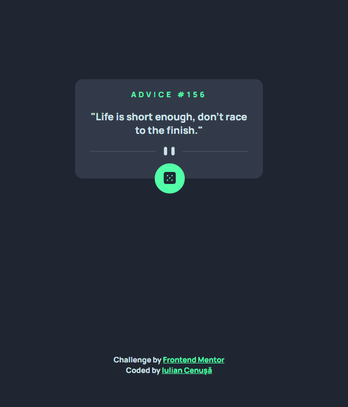

# Frontend Mentor - Advice generator app solution

This is a solution to the [Advice generator app challenge on Frontend Mentor](https://www.frontendmentor.io/challenges/advice-generator-app-QdUG-13db). Frontend Mentor challenges help you improve your coding skills by building realistic projects.

## Table of contents

- [Overview](#overview)
  - [The challenge](#the-challenge)
  - [Screenshot](#screenshot)
  - [Links](#links)
- [My process](#my-process)
  - [Built with](#built-with)
  - [Tested with](#tested-with)
  - [What I learned](#what-i-learned)
  - [Continued development](#continued-development)
  - [Useful resources](#useful-resources)
- [Author](#author)

## Overview

### The challenge

Users should be able to:

- view the page
- press a button and get data from [Advice Slip JSON API](https://api.adviceslip.com/) that will be displayed in the page.

### Screenshot

### Links

- Solution URL: [GitHub](https://github.com/iulian-cenusa/frontend-mentor-advice-generator-app)
- Live Site URL: [GitHub Pages](https://iulian-cenusa.github.io/frontend-mentor-advice-generator-app/)

## My process

### Built with

- Semantic HTML5 markup
- CSS custom properties
- Flexbox
- Mobile-first workflow

### Tested with

- Java + [Maven](https://maven.apache.org/index.html)
- [JUnit5](https://junit.org/junit5/)
- [Selenium](https://www.selenium.dev/)

### What I learned

In this project I used Automated testing techniques in order to make sure that some elements of the page are loaded correctly and in order to see that the API is working and sends the requested data and its displayed.

### Continued development

As usual the project is not finished and it could be improved to look like the design but my goal was to practive testing on a "real" project.

## Author

- [GitHub Profile](https://github.com/iulian-cenusa)
- [Bitbucket Profile](https://bitbucket.org/iulian_cenusa/)
- [Frontend Mentor Profile](https://www.frontendmentor.io/profile/iulian-cenusa)
- [CodePen Profile](https://codepen.io/iulian-cenusa/)
- [Twitter Profile](https://twitter.com/IulianCenusa)
